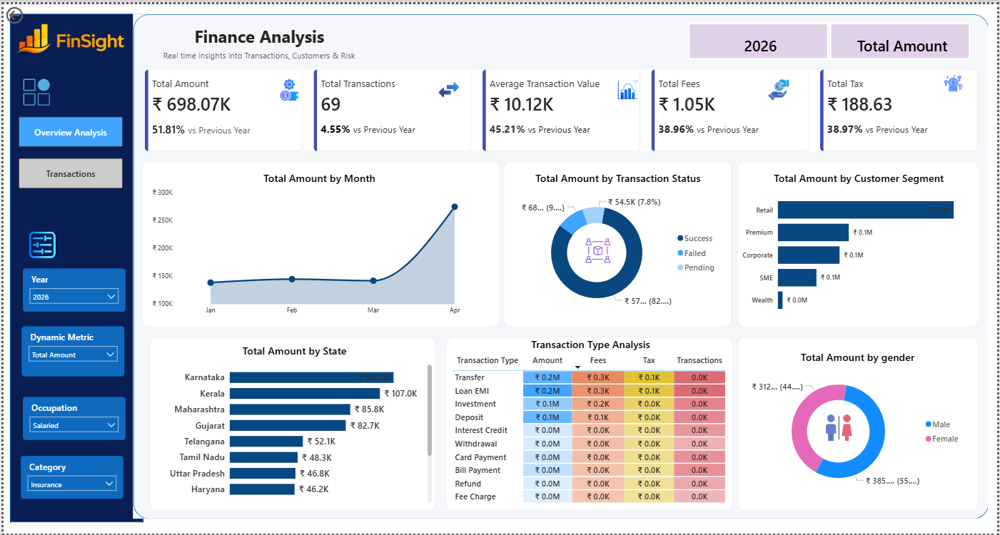
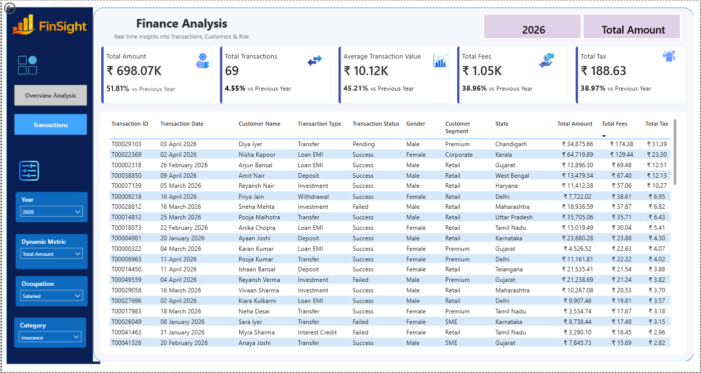

# Finance Dashboard

## Overview
This is my first Power BI Finance Dashboard built to learn Power BI and DAX.

## Tools Used
- Power BI
- Power Query
- DAX

## Features
- Interactive dashboard
- Financial KPIs
- Data visualization
- DAX measures

## Dashboard Preview

### Overview Analysis

### Transactions

## Learning Source
Created by following the Data Tutorials YouTube channel.

## Author
Harshali Hemraj Nerkar
